# CSP451 Milestone 3 — Submission

**Student Name:** Ray Chang  
**Student ID:** ychang61  
**GitHub Repo:** https://github.com/yjchang61/CSP451-milestone3  
**Live URL:** http://cloudmart-2036928.canadaeast.azurecontainer.io

---

## 1. Azure Login and Resource Verification

```bash
az group show --name Student-RG-2036928 -o table
az resource list --resource-group Student-RG-2036928 -o table
```

**Output:**
```
Name                Location      Status
------------------  ------------  ---------
Student-RG-2036928  canadaeast    Succeeded
```

**Screenshot:** Resource group overview showing ACI + Cosmos DB + ACR

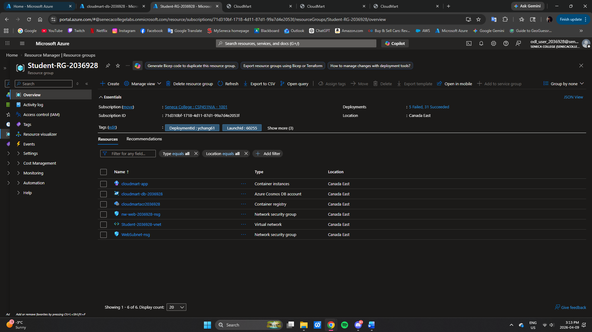

---

## 2. Cosmos DB Setup

```bash
az cosmosdb show --name cloudmart-db-2036928 --resource-group Student-RG-2036928 -o table
```

**Screenshots:** Data Explorer with products, cart, and orders containers

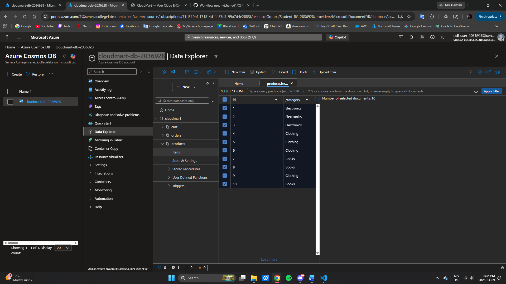

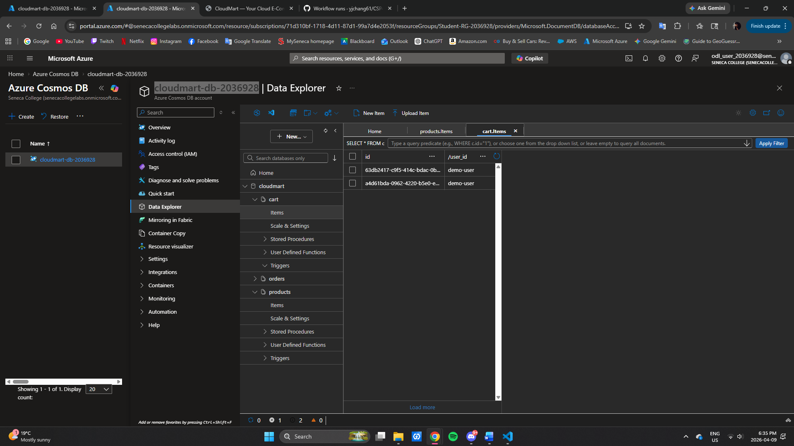

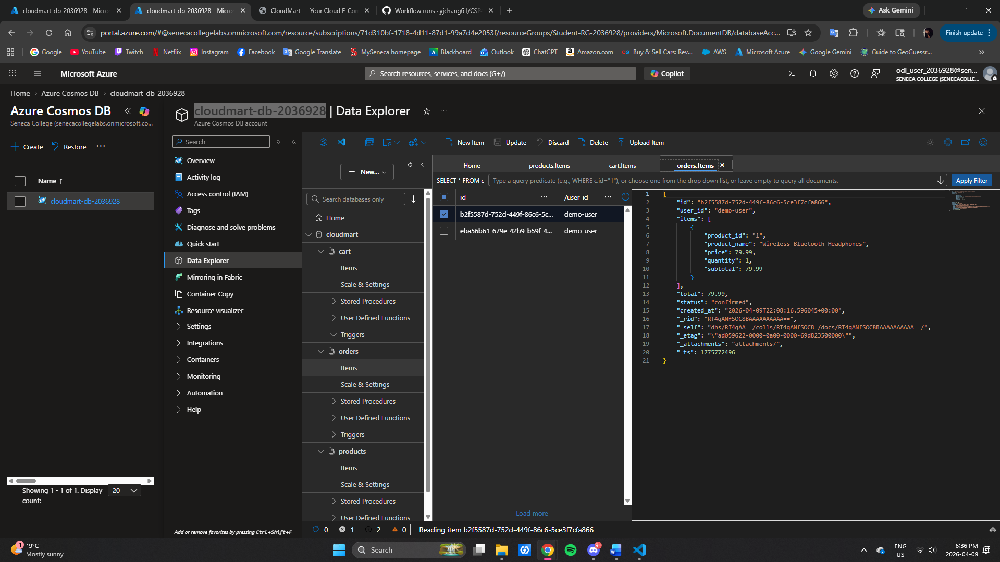

---

## 3. Application Development

Key files: `main.py`, `database.py`, `models.py`, `seed_data.py`

### Local curl test output:

```bash
curl http://localhost:8000/health | python3 -m json.tool
curl http://localhost:8000/api/v1/products | python3 -m json.tool
curl http://localhost:8000/api/v1/categories | python3 -m json.tool
```

**Output:**
```
{
  "status": "healthy",
  "database": "connected"
}
```

```
[
  {
    "id": "1",
    "name": "Wireless Bluetooth Headphones",
    "price": 79.99,
    "category": "Electronics"
  },
  {
    "id": "2",
    "name": "USB-C Fast Charging Cable (3-Pack)",
    "price": 19.99,
    "category": "Electronics"
  }
]
```

```
[
  "Books",
  "Clothing",
  "Electronics"
]
```

---

## 4. Docker Build and Test

```bash
docker build -t cloudmart-api .
docker run -p 8080:80 -e COSMOS_ENDPOINT="..." -e COSMOS_KEY="..." cloudmart-api
```

**Screenshot:** docker build output
**Screenshot:** App running locally at http://localhost:8080

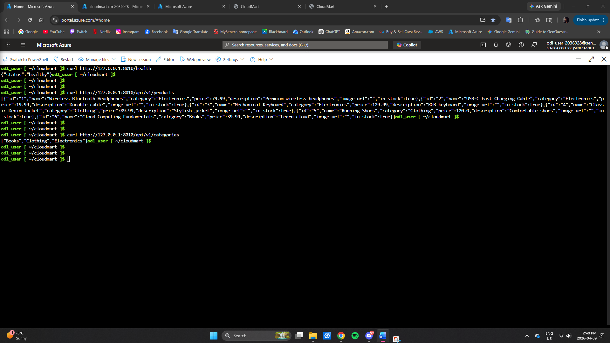

---

## 5. Azure Deployment

```bash
az container show --resource-group Student-RG-2036928 --name cloudmart-app -o table
```

**Screenshots:** ACI details (running, IP, FQDN), live endpoint, homepage, and container logs

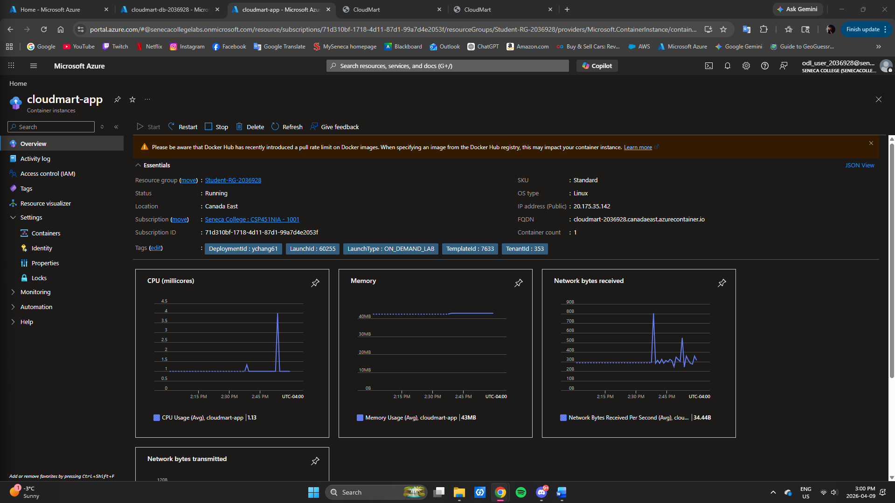

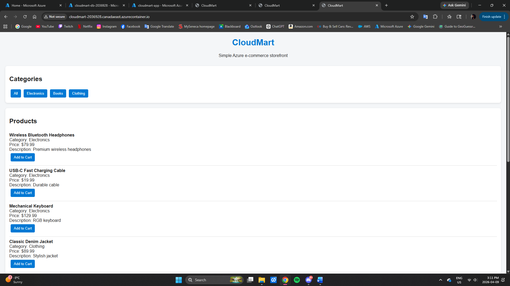

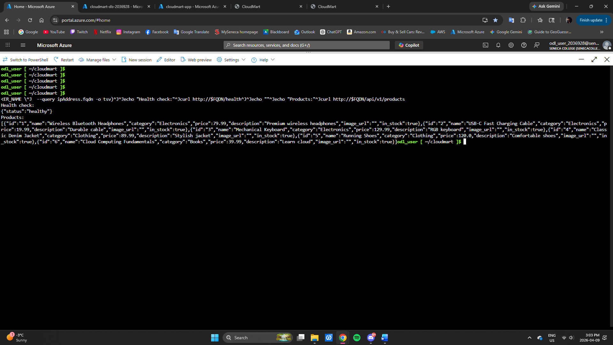

The application is accessible via the public FQDN and fully functional in a browser.

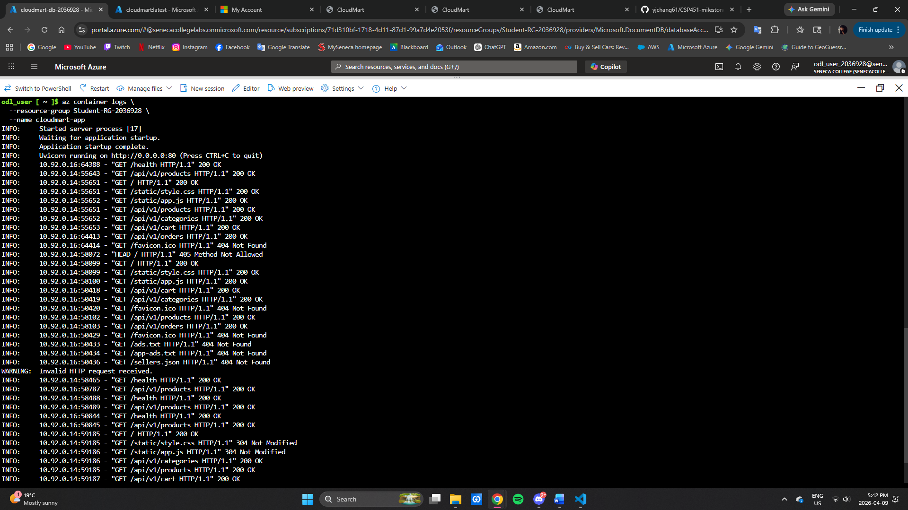

---

## 6. CI/CD Pipeline

**Screenshot:** GitHub Secrets settings page (9 secrets configured)
**Screenshot:** GitHub Actions CI + CD passing
**Screenshot:** ACR repository with image tags

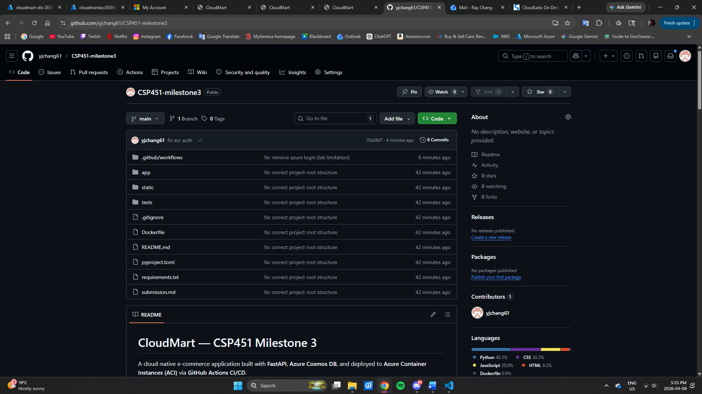

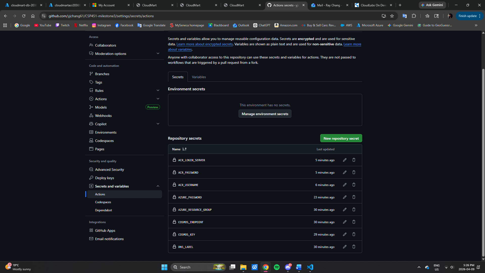

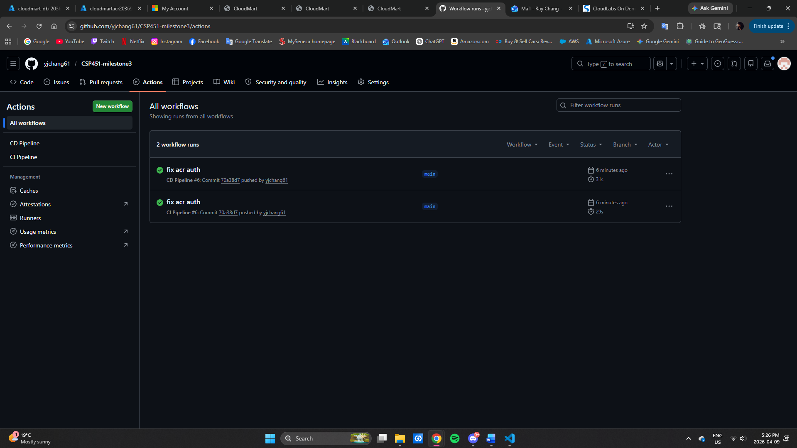

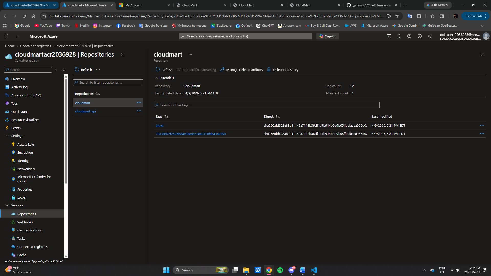

---

## 7. End-to-End Testing

All endpoints tested successfully:
- Homepage: 200 OK
- Health: healthy
- Products: returned JSON list
- Categories: returned JSON list
- Cart: returned current cart items
- Orders: successfully created and retrieved

---

## 8. Notes

- CI pipeline: `.github/workflows/ci.yml`
- CD pipeline: `.github/workflows/deploy.yml`
- Secrets required: `ACR_LOGIN_SERVER`, `ACR_USERNAME`, `ACR_PASSWORD`, `COSMOS_ENDPOINT`, `COSMOS_KEY`

### Additional Tests:

```bash
# Test 9: Place order
curl -X POST $BASE_URL/api/v1/orders | python3 -m json.tool

# Test 10: View orders
curl $BASE_URL/api/v1/orders | python3 -m json.tool

# Test 11: Verify cart is empty
curl $BASE_URL/api/v1/cart | python3 -m json.tool
```

**Output:**
```
{
  "message": "Order placed successfully",
  "order": {
    "id": "<order-uuid>",
    "user_id": "demo-user",
    "items": [
      {
        "product_id": "1",
        "product_name": "Wireless Bluetooth Headphones",
        "price": 79.99,
        "quantity": 2,
        "subtotal": 159.98
      }
    ],
    "total": 159.98,
    "status": "confirmed",
    "created_at": "2026-04-09T12:34:56.789123+00:00"
  }
}
```

```
[
  {
    "id": "<order-uuid>",
    "user_id": "demo-user",
    "items": [
      {
        "product_id": "1",
        "product_name": "Wireless Bluetooth Headphones",
        "price": 79.99,
        "quantity": 2,
        "subtotal": 159.98
      }
    ],
    "total": 159.98,
    "status": "confirmed",
    "created_at": "2026-04-09T12:34:56.789123+00:00"
  }
]
```

```
[]
```

### 5 Browser Screenshots:
1. Homepage — full product catalog
   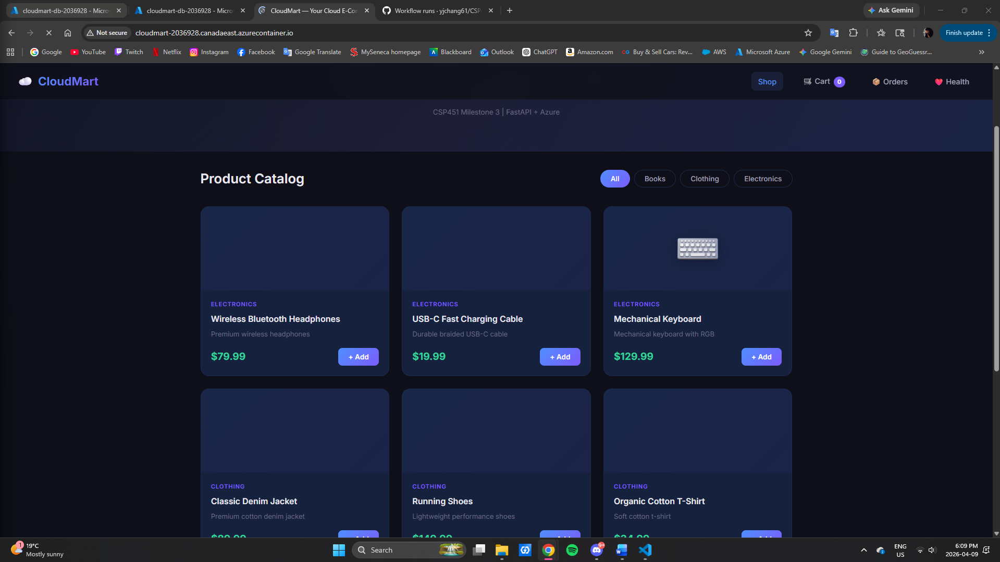
2. Category filter — filtered products
   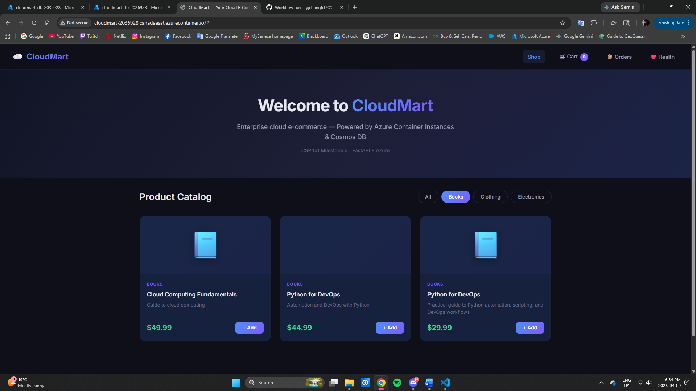
3. Cart — items with total price
   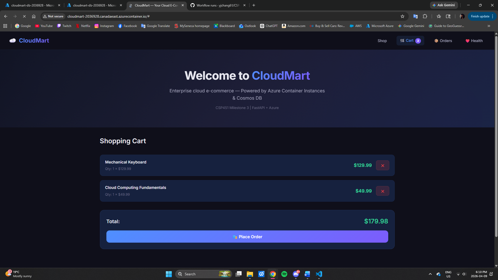
4. Order confirmation — successful placement
   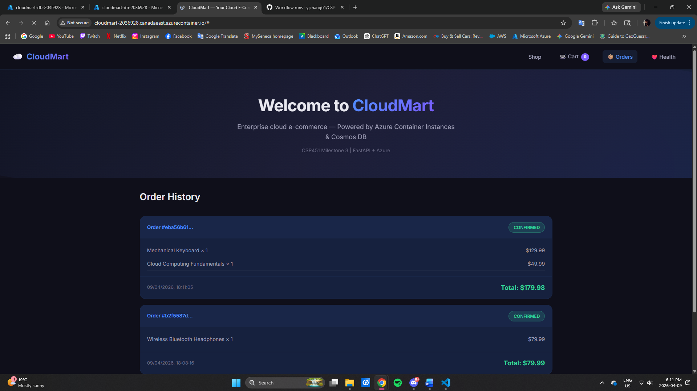
5. /health endpoint — JSON response
   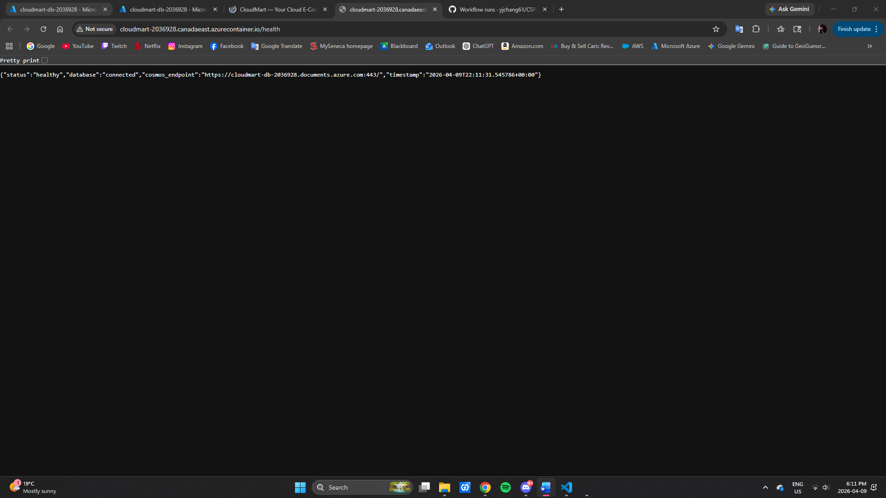

---

## 9. Reflection

### Q1: Security Model Comparison
In Milestone 1, virtual machines were protected using Network Security Groups (NSGs), which restrict traffic at the network level. In contrast, Azure Container Instances are directly exposed to the internet through a public IP, making them less secure by default. In production, I would add Azure Application Gateway with WAF, use private networking (VNet integration), and secure secrets using Azure Key Vault.

### Q2: Monitoring
Monitoring can be implemented using Azure Monitor to collect container logs and metrics, similar to how flow logs were used in Milestone 2. The `/health` endpoint provides application-level monitoring, while logs can be analyzed in Log Analytics to detect issues or abnormal traffic patterns. Alerts can also be configured to notify when failures or unusual activity occur.

### Q3: Scaling
If CloudMart needed to support 10,000 concurrent users, I would migrate from Azure Container Instances to Azure Kubernetes Service (AKS). This would allow horizontal scaling, load balancing, and better resource management. I would also introduce caching (e.g., Redis) to reduce database load and improve performance.

This implementation demonstrates a fully automated DevOps workflow from development to deployment, integrating cloud infrastructure, CI/CD pipelines, and database persistence.
